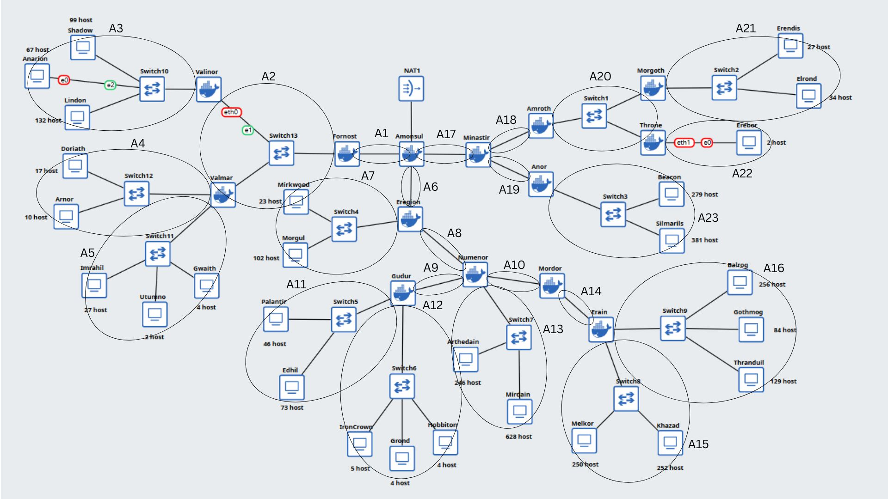
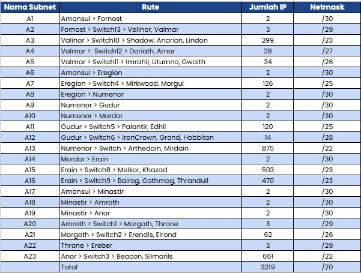
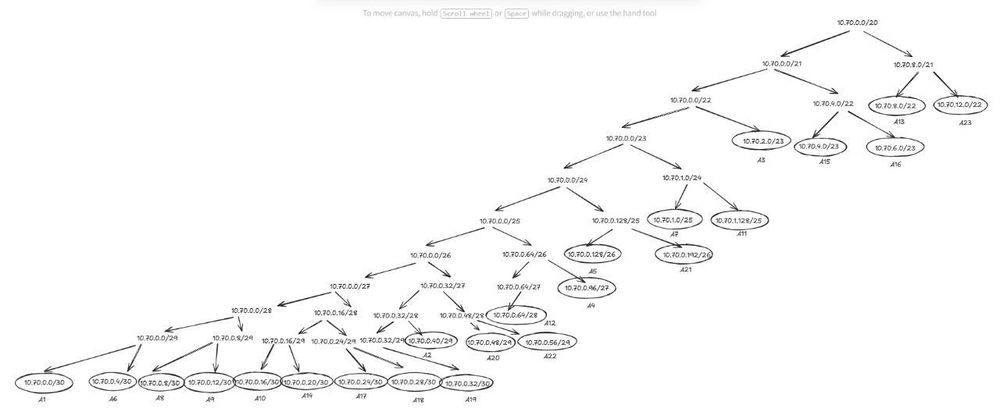
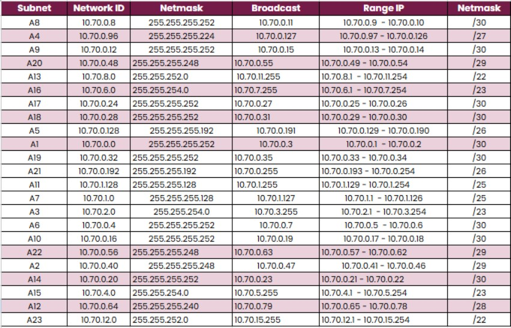

# Jarkom-Modul-4-2025-K-13

## Topologi GNS3

Setelah menganalisis topologi yang diberikan, kita dapat melanjutkan dengan melakukan perencanaan alokasi IP address melalui tahapan berikut:

## Rute

1. Identifikasi Subnet
Berdasarkan topologi, kita perlu mengidentifikasi seluruh segmen jaringan yang membutuhkan alokasi IP address, mulai dari subnet besar hingga subnet kecil

## VLSM

### VLSM TREE

2. Penyusunan Pohon VLSM
Subnet dengan kebutuhan host terbesar dialokasikan terlebih dahulu, kemudian sisa network dibagi secara bertahap untuk subnet yang lebih kecil.

## Tabel VLSM  

3. Pengisian Tabel VLSM
Hasil dari pohon VLSM kemudian didokumentasikan dalam tabel alokasi yang mencakup network address, netmask, range IP yang tersedia, dan broadcast address untuk setiap subnet.

4.Implementasi
Dengan tabel VLSM yang telah disusun, kita dapat melakukan konfigurasi IP address pada setiap device di GNS3 sesuai dengan alokasi yang telah ditentukan, memastikan konektivitas antar segmen jaringan berfungsi dengan baik.
----------------------------------------------------------
### Revisi
Telah dilakukan penyesuaian alokasi IP address pada beberapa subnet karena sebelumnya ditemukan adanya overlap atau tabrakan alokasi network. Penyesuaian ini memastikan setiap segmen jaringan memiliki range IP yang benar-benar unik dan tidak saling tumpang-tindih.

### Kendala
Beberapa router/node masih belum dapat melakukan ping ke subnet yang berbeda.
Permasalahan konektivitas lintas subnet ini masih memerlukan troubleshooting lebih lanjut untuk memastikan routing table dan konfigurasi gateway pada setiap device telah sesuai dengan desain jaringan yang direncanakan.
